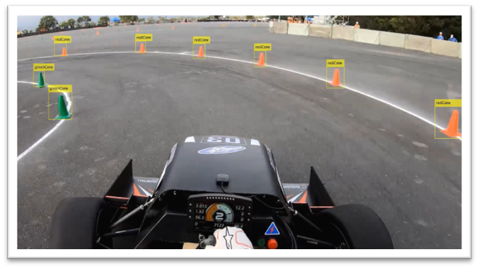

# Cone Detection Using Deep Learning for Formula Student Driverless 
<!-- This is the "Title of the contribution" that was approved during the Community Contribution Review Process --> 

<!-- Add the "File Exchange" icon to the README if this repo also appears on File Exchange via the "Connect to GitHub" feature --> 
<!-- Add the "Open in MATLAB Online" icon to the README to open a particular file on MATLAB Online --> 

This project presents a complete workflow for cone detection in Formula Student Driverless scenarios using deep learning. It demonstrates how to use MATLAB® and Simulink® for data preparation and labeling, YOLOX neural network design and training, and deployment to a GPU for real-time inference. We gratefully acknowledge the DIAN Racing Team at Tongji University, China, for providing the video datasets used in this demonstration. 

<!--- Please remember to delete all template related text that you are not using within your README.md ---> 

## Installation 
This project has been tested on MATLAB® release R2024b and R2025a. Before getting started, ensure that the below MathWorks Products and Support Packages are installed and configured correctly in MATLAB®: 
### MathWorks Products
* [Image Processing Toolbox™](https://www.mathworks.com/products/image-processing.html)
* [Computer Vision Toolbox™](https://www.mathworks.com/products/computer-vision.html)
* [Deep Learning Toolbox™](https://www.mathworks.com/products/deep-learning.html)
* [Parallel Computing Toolbox™](https://www.mathworks.com/products/parallel-computing.html)
* [MATLAB Coder™](https://www.mathworks.com/products/matlab-coder.html)
* [GPU Coder™](https://www.mathworks.com/products/gpu-coder.html)
### Support Packages
* [The Computer Vision Toolbox™ Automated Visual Inspection Library](https://www.mathworks.com/matlabcentral/fileexchange/116555-automated-visual-inspection-library-for-computer-vision-toolbox) 
* [MATLAB Coder Support Package for NVIDIA Jetson and NVIDIA DRIVE Platforms](https://www.mathworks.com/matlabcentral/fileexchange/68644-matlab-coder-support-package-for-nvidia-jetson-and-nvidia-drive-platforms) 

Please see the [Setup and Configuration](https://www.mathworks.com/help/coder/setup-and-configuration.html) for detailed setup and configuration instructions of the [MATLAB Coder Support Package for NVIDIA Jetson and NVIDIA DRIVE Platforms](https://www.mathworks.com/matlabcentral/fileexchange/68644-matlab-coder-support-package-for-nvidia-jetson-and-nvidia-drive-platforms) . 
<!--- Make sure you have a Installation.md document in the Documentation folder if you are to follow this formatting.  You can choose your own folder formatting if you prefer --->

## Getting Started 
Information about Getting Started
<!--- List or link to any relevent Documentation to help the user Get Started --->
* Open the `coneDetectionWithYOLOX.mlx` live script in MATLAB®, and run the code section-by-section to understand the workflow. **Please note:** In Step 7, do not forget to change the NVIDIA Jetson™ GPU settings to your own, and also change the video name *vidName* in the `coneDetection.m` to the file location of your own test video. 
* Open the `coneDetectionWithObjectDetectorBlock.slx` in Simulink® and update the **File name** of the "From Multimedia File" block and the **File path** of the "Deep learning Object Detector" block to your own file name or path.

## License
<!--- Make sure you have a License.txt within your Repo --->

The license is available in the `license.txt` file in this GitHub repository.

## Community Support
[MATLAB Central](https://www.mathworks.com/matlabcentral)

Copyright 2025 The MathWorks, Inc.

<!--- Do not forget to the add the SECURITY.md to this repo --->
<!--- Add Topics #Topics to your Repo such as #MATLAB  --->

<!--- This is my comment --->

<!-- Include any Trademarks if this is the first time mentioning trademarked products (For Example:  MATLAB&reg; Simulink&reg; Trademark&trade; Simulink Test&#8482;) --> 

